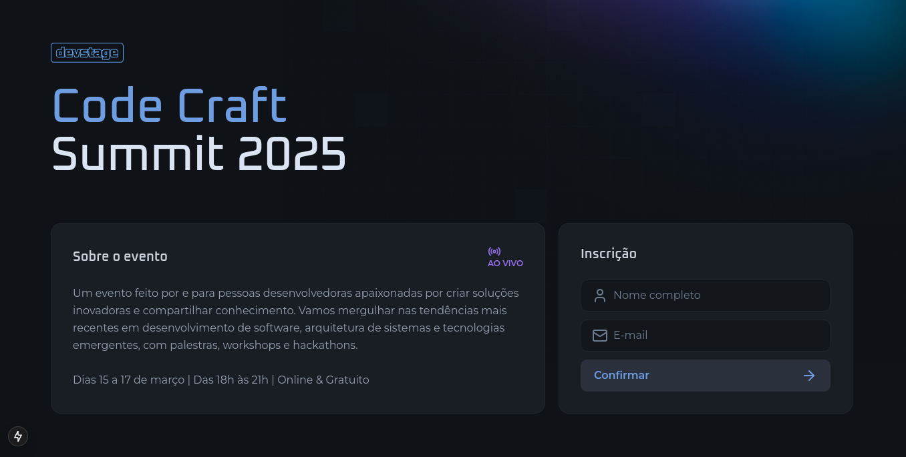
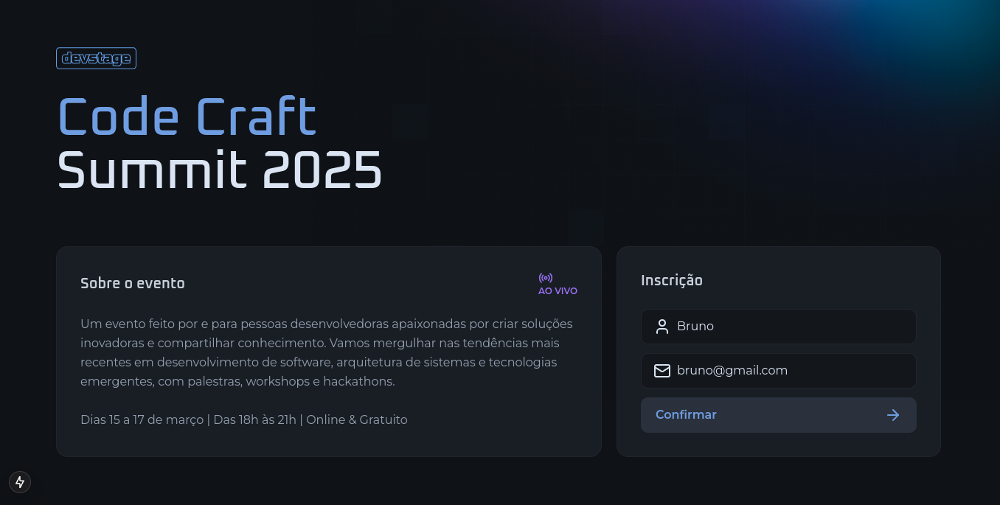
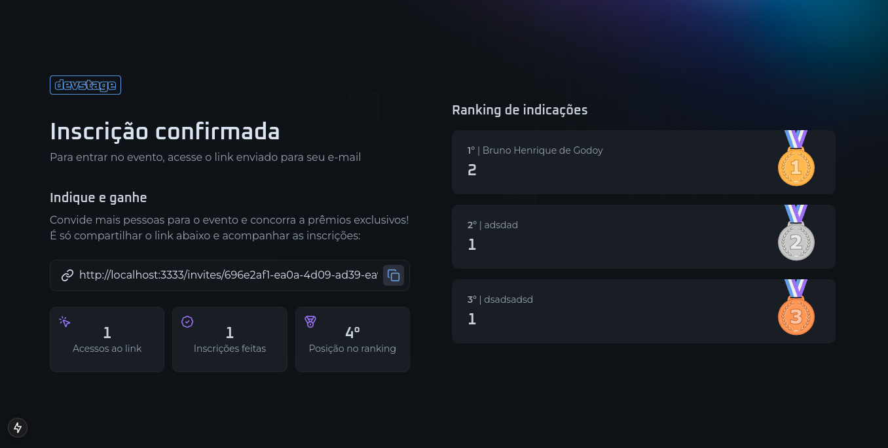

  <h1 align="center">DevStage</h1>

## 💻 Sobre

O projeto é um site responsivo de inscrição e indicação para eventos, construido na trilha de React no NLW Connect, um evento gratuito da Rocketseat com o professor Diego, onde tive a oportunidade de aprender NextJs e Tailwind CSS.

___

## 🚀 Tecnologias

Este projeto foi desenvolvido com as seguintes tecnologias:

- [React](https://react.dev/)
- [TypeScript](https://www.typescriptlang.org/)
- [NextJs](https://nextjs.org/)
- [Lucide Icons](https://lucide.dev/)
- [React-Hook-Form](https://react-hook-form.com/)
- [Zod](https://zod.dev/)
- [Tailwind CSS](https://tailwindcss.com/)

___

## 🎨 Layout

___

Made with ❤️ by Bruno Henrique de Godoy 👋🏽 [Get in Touch!](https://www.linkedin.com/in/bruno-godoy-07806726b/)
